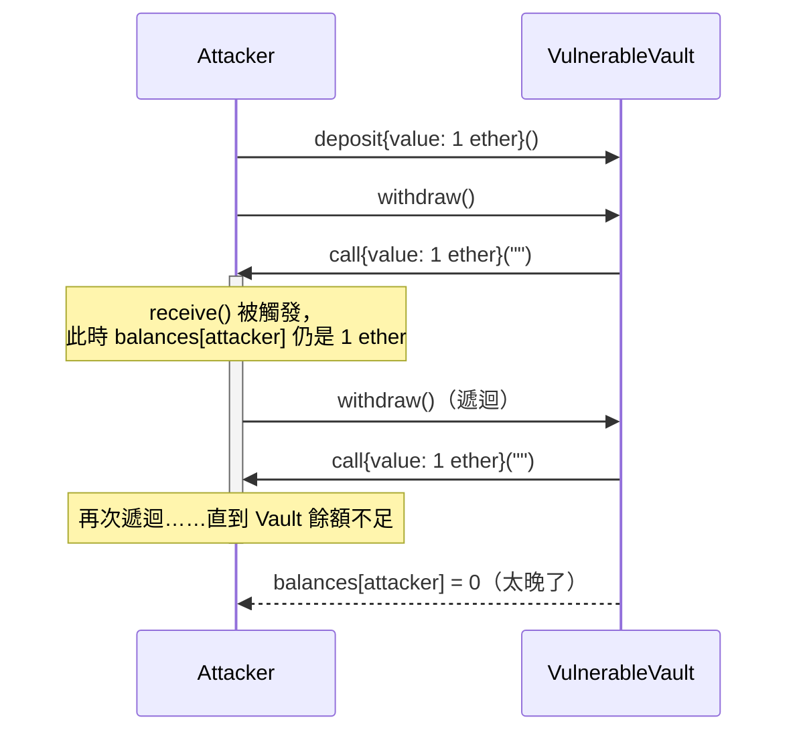

# 漏洞 #1：Reentrancy（重入攻擊）

> 對應程式碼：
> - 漏洞版：[`src/vulnerable/01_Reentrancy.sol`](../../src/vulnerable/01_Reentrancy.sol)
> - 修補版：[`src/fixed/01_Reentrancy_Fixed.sol`](../../src/fixed/01_Reentrancy_Fixed.sol)
> - 攻擊合約：[`test/exploits/ReentrancyAttacker.sol`](../../test/exploits/ReentrancyAttacker.sol)
> - 測試：[`test/exploits/01_Reentrancy.t.sol`](../../test/exploits/01_Reentrancy.t.sol)

## 漏洞原理

`VulnerableVault` 是一個最陽春的存提款合約：使用者 `deposit()` 存入 ETH，`withdraw()`
把自己存的全部領出來。問題出在 `withdraw()` 的執行順序：

```solidity
function withdraw() external {
    uint256 amount = balances[msg.sender];
    require(amount > 0, "VulnerableVault: nothing to withdraw");

    // 先轉帳（Interaction）……
    (bool success,) = msg.sender.call{value: amount}("");
    require(success, "VulnerableVault: transfer failed");

    // ……才更新狀態（Effect）
    balances[msg.sender] = 0;
}
```

正確的模式應該是 **Checks-Effects-Interactions（CEI）**：先檢查、再更新狀態、
最後才跟外部世界互動。這裡反過來了——狀態更新被放到了外部呼叫之後。

當 `msg.sender` 是一個合約時，`.call{value: amount}("")` 會觸發它的
`receive()`（或 `fallback()`）。此時 EVM 的執行權轉移到了呼叫者手上，
而 Vault 這邊 `balances[msg.sender]` **都還沒歸零**。如果呼叫者在
`receive()` 裡再呼叫一次 `withdraw()`，`require(amount > 0)` 檢查依然會
通過（因為餘額還是舊值），於是又觸發一次轉帳——如此遞迴下去，直到
Vault 的 ETH 餘額不夠付一次為止。

這正是 2016 年 The DAO 事件的核心漏洞模式（雖然當時情境更複雜，牽涉到
`splitDAO` 的遞迴呼叫），也是至今智能合約審計中最常被檢查的漏洞類型之一。

## 攻擊流程

`ReentrancyAttacker.sol` 示範了完整攻擊：

1. 三個正常使用者 Alice、Bob、Carol 各存 1 ETH 進 Vault（Vault 總計 3 ETH，
   模擬真實情境下裡面有其他人的錢）
2. 攻擊者部署 `ReentrancyAttacker`，只存入 **1 ETH** 本金
3. 呼叫 `attack()`：先 `deposit()` 存 1 ETH，接著呼叫第一次 `withdraw()`
4. Vault 的 `.call{value: 1 ether}("")` 把 ETH 送進攻擊合約，觸發
   `receive()`
5. `receive()` 裡再呼叫一次 `vault.withdraw()` —— 因為
   `balances[attacker]` 還沒被歸零，這次呼叫一樣會成功轉出 1 ETH
6. 重複步驟 4-5，直到 Vault 餘額 < 1 ETH 為止



測試結果（`forge test -vvv`）：攻擊者只用 1 ETH 本金，把整個 Vault
（含 Alice、Bob、Carol 存的 3 ETH）**全部領光**，總共偷走 4 ETH，
遞迴呼叫了 4 次 `withdraw()`。

```
[PASS] test_Exploit_VulnerableVault_DrainsAllFunds() (gas: 393707)
Logs:
  reentry count: 4
  attacker stole (wei): 4000000000000000000
```

## 修補方式

`SafeVault`（`src/fixed/01_Reentrancy_Fixed.sol`）疊了兩層防禦：

**1. 遵循 CEI**：把「歸零餘額」搬到轉帳之前。

```solidity
function withdraw() external nonReentrant {
    uint256 amount = balances[msg.sender];
    require(amount > 0, "SafeVault: nothing to withdraw");

    balances[msg.sender] = 0;                       // Effect 先做

    (bool success,) = msg.sender.call{value: amount}("");
    require(success, "SafeVault: transfer failed");  // Interaction 後做

    emit Withdrawn(msg.sender, amount);
}
```

光是這樣就足以擋下攻擊：遞迴呼叫進來時 `balances[msg.sender]` 已經是 0，
`require(amount > 0)` 會直接 revert。

**2. OpenZeppelin `ReentrancyGuard`（`nonReentrant`）**：多加一層鎖，
即使未來程式碼被改動、不小心破壞了 CEI 順序，這層還是能擋下重入。
這是業界標準做法——**不重新造輪子**，直接用 OpenZeppelin 的成熟實作。

## 驗證修補生效

用同一支攻擊合約（`ReentrancyAttackerOnSafeVault`）打 `SafeVault`，
測試結果如下，而且有個值得記錄的小細節：

```
[PASS] test_Patched_SafeVault_BlocksReentrancy() (gas: 396417)
Logs:
  attack() reverted entirely; vault balance unchanged: 3000000000000000000
```

原本預期是「攻擊者遞迴呼叫被擋下、只能拿回自己存的本金」，但實測發現
**整筆 `attack()` 交易直接完整回滾**，攻擊者連自己存的 1 ETH 都拿不回來。
原因是：

1. `nonReentrant` 在遞迴呼叫 `withdraw()` 的當下會 revert（原始錯誤是
   `ReentrancyGuard: reentrant call`）
2. 但這次遞迴是透過 Vault 裡的低階呼叫 `msg.sender.call{value: amount}("")`
   觸發的——低階 `.call()` 不會把子呼叫的 revert 往上冒泡，而是把它
   吞掉、回傳 `success = false`
3. 於是外層 `require(success, "SafeVault: transfer failed")` 才是最終
   丟出來的錯誤訊息
4. 因為 `attack()` 本身沒有用 `try/catch` 包住這次呼叫，Solidity 對未
   捕捉的 revert 預設會把**整筆交易**（含一開始成功的 `deposit()`）
   一起回滾

這其實是更強的保護效果，而且是理解 Solidity 錯誤傳遞機制
（低階 call 吞掉 revert reason、交易原子性）很好的例子。

驗證涵蓋三個情境：
- 攻擊 `VulnerableVault` 成功淨空資金（證明漏洞真實存在）
- 攻擊 `SafeVault` 完整 revert，其他存款人的錢完全不受影響（證明修補生效）
- 正常存提款流程在修補版上依然正常運作（證明修補沒有破壞既有功能）

## 小結

Reentrancy 的本質是「外部呼叫把控制權讓渡給了不受信任的地址，
而狀態還沒收尾」。防禦的核心思路很單純：**別讓外部呼叫發生在
狀態還沒定案的時候**（CEI），並且用經過大量審計的函式庫
（`ReentrancyGuard`）做第二層保險，而不是自己手刻鎖變數。
